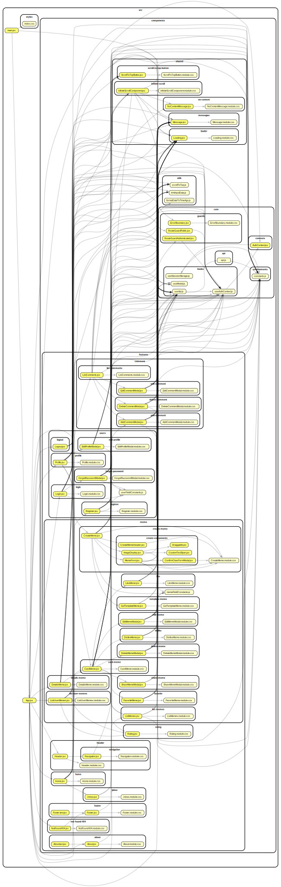

# Memelandia - Your Memes, Your Way

Welcome to Memelandia, a platform that empowers users to create, share, and engage with memes effortlessly. Memelandia provides a seamless experience, allowing users to express their creativity, interact with content, and build a vibrant meme community.

## Table of Contents

1. [Overview](#overview)
2. [Demo](#demo)
3. [User Permissions](#user-permissions)
4. [Deployment](#deployment)
5. [Application Architecture](#application-architecture)
6. [Screenshots](#screenshots)

## Overview

Memelandia enables users to:

-   Create and post memes
-   Like, dislike, comment, and add memes to favorites
-   Share memes with a shortened, uniform link
-   Access external APIs for jokes and meme templates
-   Explore top-rated memes on the home page
-   Manage user profiles with personal statistics
-   Rate memes based on user interactions

## Demo

Check out the live demo of MemeLandia at [https://memelandia.vercel.app/](https://memelandia.vercel.app/)

For a quick exploration, you can use the following demo accounts:

-   **Demo User 1:**

    -   Username: mem4o
    -   Email: peter@abv.bg
    -   Password: 123456

-   **Demo User 2:**
    -   Username: jonathan
    -   Email: john@abv.bg
    -   Password: 123456

## User Permissions

-   **Not-Logged User:**

    -   View all memes
    -   Use search functionality
    -   View all memes of a specified user

-   **Logged-In User (Not Owner):**

    -   Like, dislike, comment on memes
    -   Add memes to favorites
    -   Share memes

-   **Logged-In User (Owner):**
    -   Edit and delete own memes
    -   Share memes

## Deployment

### Backend Deployment

The backend of MemeLandia is deployed on [Vercel](https://vercel.com/). The backend handles the core functionalities, including user authentication.

### Frontend Deployment

The React frontend of Memelandia is deployed on [Vercel](https://vercel.com/). Vercel serves the frontend to users and provides a seamless browsing experience.

### Database

The MongoDB database used for MemeLandia is hosted on [MongoDB Cloud](https://cloud.mongodb.com). MongoDB Cloud ensures reliable and scalable data storage for the application.

### Cloud Storage for Memes

MemeLandia utilizes [ImgBB](https://imgbb.com/) as the cloud storage provider for saving memes. ImgBB provides a reliable and efficient solution for handling image uploads, ensuring a smooth experience for users.

To integrate ImgBB into your project:

1. **Sign up for an ImgBB account:** Visit [ImgBB](https://imgbb.com/) and create an account.

2. **Get API Key:** Obtain your ImgBB API key from your account settings.

3. **Configure Environment Variables:** Set up your project's environment variables and include the ImgBB API key for seamless integration.

## Application Architecture

The following application architecture diagram is generated using [dependency-cruiser](https://github.com/sverweij/dependency-cruiser). It visually represents the dependencies within the project.

**Key:**
-   **Arrows:** Represent the direction of the dependencies (from → to).

For a detailed analysis of dependencies, you can run dependency-cruiser in your project. To get started, visit the [dependency-cruiser on NPM](https://www.npmjs.com/package/dependency-cruiser)

## Screenshots

### Desktop

-   
-   
-   

### Mobile

-   
-   
-   
